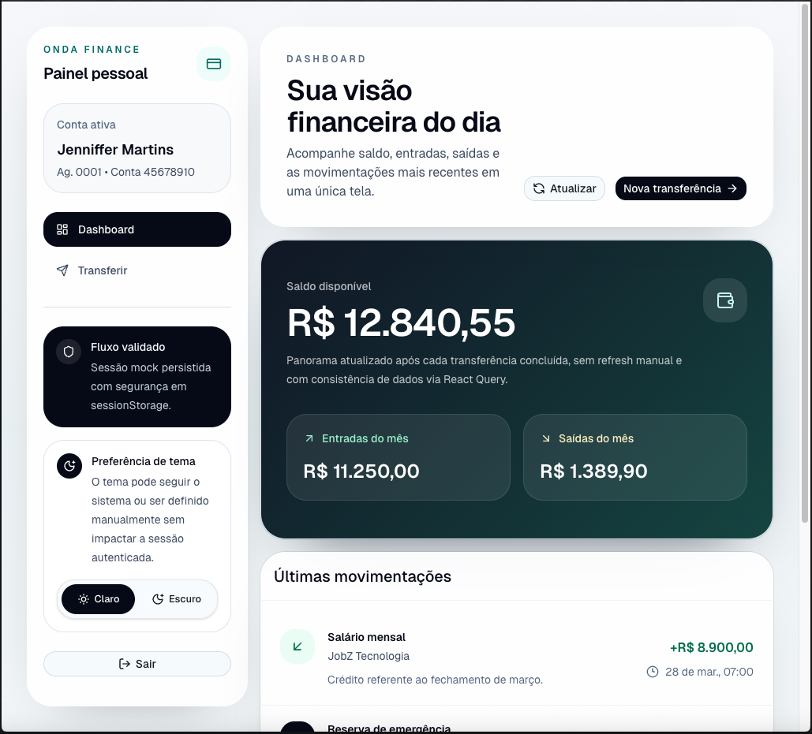
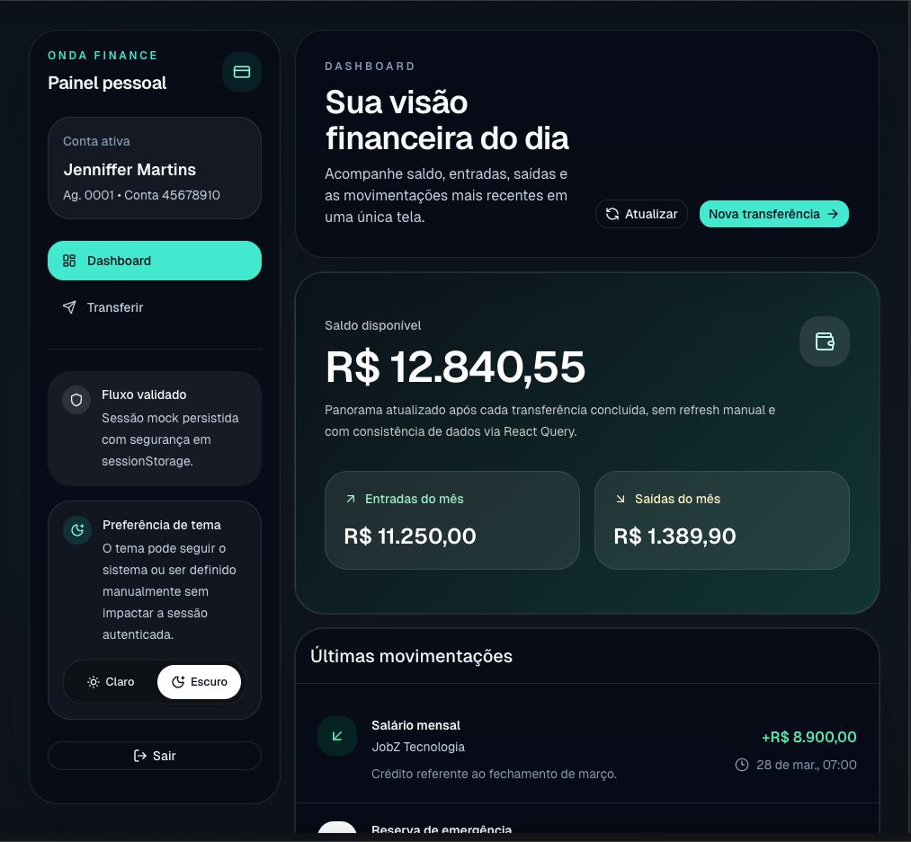
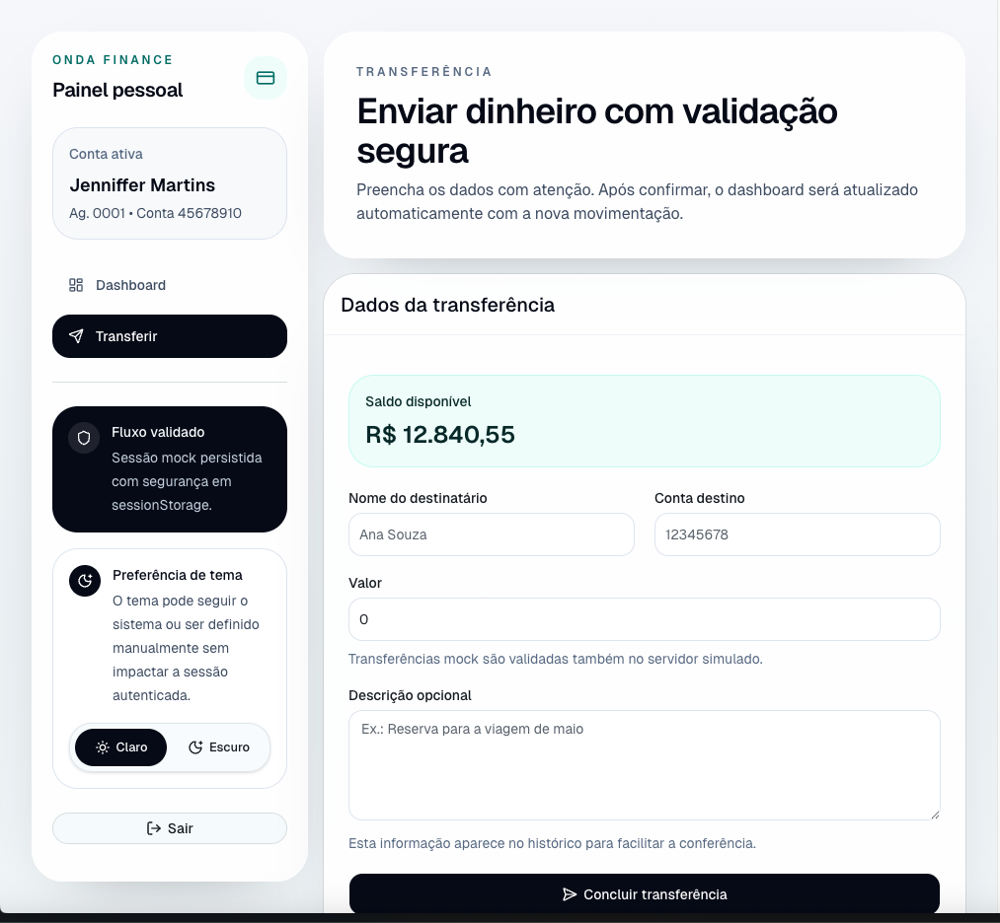
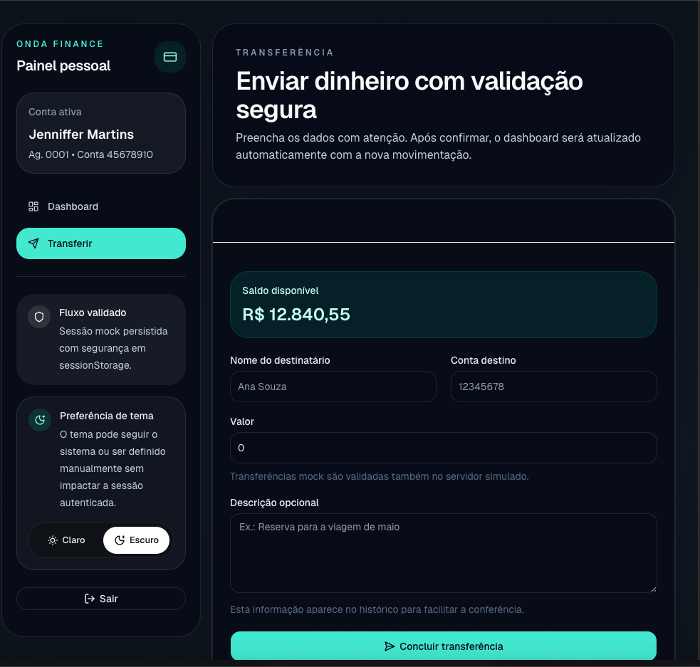

<div align="center">

# Teste Prático Onda Finance

Deploy: [challenge-frontend-onda-finance.vercel.app/login](https://challenge-frontend-onda-finance.vercel.app/login)

Repositório: [github.com/jenniffermartinsf/challenge-frontend-onda-finance](https://github.com/jenniffermartinsf/challenge-frontend-onda-finance)

</div>

Aplicação web desenvolvida para o teste prático da Onda Finance com foco em clareza, UX limpa, consistência visual, validação correta, fluxo ponta a ponta e base escalável para manutenção futura.

## Preview do projeto

### Login

| Light | Dark |
| --- | --- |
|  |  |

### Dashboard

| Light | Dark |
| --- | --- |
|  |  |

### Transferência

| Light | Dark |
| --- | --- |
|  |  |

## Principais recursos

- Login mock com credenciais de demonstração.
- Persistência de sessão em `sessionStorage`.
- Dashboard com saldo, entradas, saídas e histórico de transações.
- Transferência com React Hook Form + Zod.
- Atualização automática do dashboard após transferir.
- Dark mode com preferência persistida.
- Feedback visual com toast para sucesso, erro e logout.
- Testes automatizados cobrindo fluxo principal, login inválido e saldo insuficiente.
- Interface responsiva e acessível, com navegação por teclado e foco visível.

## Ambiente de configuração

O projeto foi configurado com **Vite** como ferramenta principal de desenvolvimento e build.

Documentação oficial do Vite:

- Guia do Vite: [vite.dev/guide](https://vite.dev/guide/)
- Instalação e primeiros passos: [vite.dev/guide/#scaffolding-your-first-vite-project](https://vite.dev/guide/#scaffolding-your-first-vite-project)

Pré-requisitos para rodar localmente:

- Node.js 20+
- npm 10+

Se Node.js e npm ainda não estiverem instalados, o ideal é instalar a versão LTS do Node.js no site oficial:

- [nodejs.org](https://nodejs.org/)

## Como rodar o projeto

### 1. Clonar o repositório

Abra o terminal e execute:

```bash
git clone https://github.com/jenniffermartinsf/challenge-frontend-onda-finance.git
```

### 2. Entrar na pasta do projeto

```bash
cd challenge-frontend-onda-finance
```

### 3. Instalar as dependências

```bash
npm install
```

### 4. Iniciar o projeto em modo de desenvolvimento

```bash
npm run dev
```

Depois disso, o terminal exibirá um endereço local. Normalmente será:

`http://localhost:5173`

Basta abrir esse link no navegador.

### 5. Acessar com as credenciais demo

- E-mail: `demo@onda.finance`
- Senha: `Onda@123456`

## Scripts disponíveis

- `npm run dev`: inicia o projeto localmente.
- `npm run build`: gera a build de produção.
- `npm run lint`: valida qualidade e padronização do código.
- `npm run lint:fix`: tenta corrigir automaticamente problemas simples de lint.
- `npm run format`: aplica formatação com Prettier.
- `npm run format:check`: verifica se os arquivos estão formatados.
- `npm run test`: abre o Vitest em modo interativo.
- `npm run test:run`: executa a suíte de testes uma vez.

## Tecnologias utilizadas

- [React](https://react.dev/)
- [TypeScript](https://www.typescriptlang.org/docs/)
- [Vite](https://vite.dev/guide/)
- [Tailwind CSS](https://tailwindcss.com/docs/installation/using-vite)
- [Class Variance Authority (CVA)](https://cva.style/docs)
- [shadcn/ui](https://ui.shadcn.com/docs)
- [Radix UI Primitives](https://www.radix-ui.com/primitives/docs/overview/introduction)
- [React Router](https://reactrouter.com/home)
- [TanStack Query](https://tanstack.com/query/latest/docs/framework/react/overview)
- [Zustand](https://zustand.docs.pmnd.rs/getting-started/introduction)
- [React Hook Form](https://react-hook-form.com/)
- [Zod](https://zod.dev/)
- [Axios](https://axios-http.com/docs/intro)
- [Vitest](https://vitest.dev/guide/)
- [ESLint](https://eslint.org/docs/latest/use/getting-started)
- [Prettier](https://prettier.io/docs/install)

## Arquitetura usada

O projeto foi organizado em uma arquitetura por domínio, separando responsabilidades de forma clara:

- `app/`: composição global da aplicação, providers e router.
- `components/`: componentes reutilizáveis, separados entre `ui` e `common`.
- `features/`: regras e telas organizadas por domínio (`auth`, `dashboard`, `transfer`).
- `lib/`: infraestrutura compartilhada, utilitários e camada de acesso a dados.
- `mocks/`: dados mockados usados pela API simulada.
- `routes/`: caminhos centralizados da aplicação.
- `test/`: setup e helpers de testes.

Essa organização favorece:

- manutenção mais simples;
- escalabilidade;
- separação clara de responsabilidades;
- menor acoplamento entre telas e infraestrutura.

## Estrutura do projeto

```text
src/
  app/
    providers/
      app-providers.tsx
      query-client.ts
      theme-provider.tsx
    router/
      index.tsx
      root-redirect.tsx

  components/
    common/
      app-shell.tsx
      page-header.tsx
      protected-route.tsx
      theme-toggle.tsx
      toaster.tsx
    ui/
      button.tsx
      card.tsx
      input.tsx
      label.tsx
      separator.tsx
      textarea.tsx

  features/
    auth/
      components/
        login-form.tsx
      pages/
        login-page.tsx
        login-page.test.tsx
      store/
        auth-store.ts
      types.ts
    dashboard/
      components/
        balance-card.tsx
        transaction-list.tsx
      hooks/
        use-transactions-query.ts
      pages/
        dashboard-page.tsx
      types.ts
    feedback/
      store/
        toast-store.ts
    theme/
      store/
        theme-store.ts
    transfer/
      components/
        transfer-form.tsx
      hooks/
        use-transfer.ts
      pages/
        transfer-errors.test.tsx
        transfer-page.test.tsx
        transfer-page.tsx
      schemas/
        transfer-schema.ts

  lib/
    axios.ts
    mock-api.ts
    utils.ts

  mocks/
    transactions.ts
    user.ts

  routes/
    paths.ts

  test/
    render-with-providers.tsx
    setup.ts

  index.css
  main.tsx
```

## Decisões técnicas

- A aplicação usa uma mock API baseada em adapter do Axios para manter o consumo próximo de um backend real sem acoplar a UI a chamadas soltas.
- O estado de autenticação fica em Zustand com persistência em `sessionStorage`, evitando armazenar senha e reduzindo exposição desnecessária.
- O dashboard usa React Query para cache e invalidação automática após a transferência.
- A transferência usa RHF + Zod para validação em camadas: cliente e servidor mock.
- O dark mode usa `class` no `html`, com persistência isolada em `localStorage`.
- O feedback global usa um sistema leve de toast próprio, evitando dependências extras apenas para essa função.
- O layout prioriza responsividade mobile-first, contraste consistente, semântica correta e navegação por teclado.

## Fluxo implementado

- Login mock com credenciais já preenchidas para facilitar avaliação.
- Dashboard com saldo, entradas, saídas e histórico recente.
- Transferência com validação e atualização do dashboard sem refresh manual.
- Testes cobrindo fluxo principal, autenticação inválida e saldo insuficiente.

## Segurança

- Nenhum uso de `any`.
- Nenhum uso de `dangerouslySetInnerHTML`.
- Senha nunca é persistida no store.
- Inputs sensíveis são validados com Zod antes de chegar à camada mock.
- A transferência bloqueia saldo insuficiente e impede envio para a própria conta autenticada.
- ESLint inclui verificação type-aware e regras de acessibilidade.

### Engenharia reversa

Como qualquer aplicação frontend executada no navegador, o código pode ser inspecionado. Por isso, a estratégia correta não é depender de “ocultação” do código, e sim:

- não embutir segredos no cliente;
- não expor credenciais reais no bundle;
- manter regras críticas de segurança no backend real;
- reduzir a superfície de dados expostos no frontend.

### Vazamento de dados

O projeto foi pensado para minimizar exposição desnecessária de informação:

- sessão mock persistida apenas em `sessionStorage`;
- senha nunca armazenada no estado persistente;
- validação de entrada antes de chegar à camada simulada;
- estrutura preparada para, em um cenário real, operar com HTTPS, controle de acesso no servidor, tokens seguros, CSP e rate limiting.

## Melhorias futuras

- Adicionar code-splitting por rota para reduzir o tamanho do bundle inicial.
- Criar filtros de transação e um resumo visual mais avançado no dashboard.
- Adicionar testes de acessibilidade automatizados com `axe`.
- Evoluir a mock API para MSW no ambiente de desenvolvimento e backend real em produção.
- Incluir monitoramento de erros, analytics de produto e testes E2E no fluxo de deploy.
